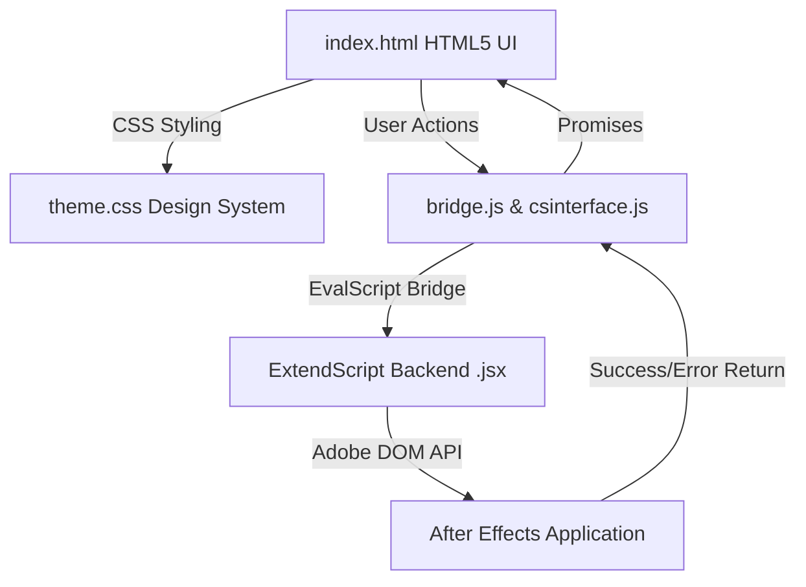

# 🚀 Motionreis Master Suite

An elite, all-in-one After Effects integration panel engineered specifically for professional motion designers, animators, and pipeline engineers operating in high-intensity production environments. Built on the Adobe CEP framework, Motionreis unifies asset organization, timeline management, character rigging, custom easing, wiggle generators, and macro rendering tools into a single, high-performance asynchronous panel.

---

> [!WARNING]
> ### ⚖️ OPEN-SOURCE LICENSE & ETHICS
> This is an **OPEN-SOURCE** repository. 
> * **NO SELLING:** Selling this software or any of its components is strictly prohibited.
> * **NO MALICIOUS MODS:** Modifying the code for malicious purposes, including but not limited to injecting backdoors, trackers, or unauthorized data collection, is a violation of this project's ethics.
> * Always respect the work of the community and keep this tool free and safe for everyone.

> [!CAUTION]
> ### ⚠️ IMPORTANT: SECURITY WARNING
> **NEVER** download or install **Motionreis Master Suite** from any source other than this official GitHub repository.
> * Third-party websites, "cracked" versions, or unofficial mirrors may contain **malware**, **keyloggers**, or **backdoors** that can compromise your professional workstation and Adobe account security.
> * We do not provide support or guarantee the integrity of files obtained from external sources.

---

## 🗺️ System Architecture

Motionreis operates on a decoupled, asynchronous execution model bridging an HTML5/JS frontend and Adobe's ExtendScript DOM backend via a highly optimized evaluation bridge.



---

## ✨ Key Features & Value Propositions

### 🎛️ 1. Zero-Displacement Rigging & Anchor Engine (`motion.jsx`)
* **Instant 3x3 Matrix Snapping:** Execute pixel-perfect anchor point repositions across single or multi-layer selections. Powered by a native geometric transformation matrix that applies automatic positional compensation, ensuring **absolute zero layer drifting or visual displacement**.
* **Smart Null Wrappers:** Streamline your workspace and eliminate timeline clutter. The engine dynamically scans selected layers to calculate exact pixel boundaries and frame-accurate time limits (`inPoint` and `outPoint`), generating target-compensated 2D/3D Null controllers that wrap your assets perfectly.
* **Advanced Path Manipulation:** Programmatic control over vector paths and automated inverse kinematics (IK) configurations for swift character and shape rigging.

### 📈 2. Kinetics & Keyframe Intelligence (`creative.jsx`)
* **Keyframe Wingman:** An elite Bezier curve slider interface built to directly manipulate keyframe velocity and influence arrays. Eliminates standard Adobe graph editor friction, bypassing heavy evaluation overhead for fluid, high-speed tweaking.
* **Wiggle Pro Sandbox:** A highly advanced, mathematically loopable wiggle engine. Features an active real-time waveform visualizer inside the DOM, enabling precision pre-render previews of frequency and amplitude modifications.
* **Custom Ease Vault:** Save, catalog, rename, and seamlessly deploy production-tested easing profiles across completely separate project files via a centralized local storage configuration.

### 🎨 3. High-Octane Layout & Design Automation (`layers.jsx`)
* **One-Click Core Spawning:** Instant, macro-driven deployment of crucial layer types (Solids, Adjustment Layers, Shapes, Cameras, and Lights) pre-configured with optimal production parameters to trim seconds off repetitive tasks.
* **Shape Exploder (`explodeShapeLayer`):** Instantly fragment compound Shape Layer groups into individual, standalone layers with clean inheritance, unlocking rapid micro-animation workflows.
* **Procedural Typographic & Camera Rigs:** Out-of-the-box injection systems for responsive typewriting expressions, natural handheld camera shakes, and multi-node interactive parallax setups.

### ⚙️ 4. Enterprise-Grade Pipeline & Macro Utilities (`pipeline.jsx`)
* **Power Precomp:** Scans target selections, extracts bounding limits, nests assets, and structurally trims the resulting pre-composition down to the exact frame boundaries automatically, enforcing absolute timeline cleanliness.
* **Auto-Prism Taxonomy:** An intelligent asset tagging system that applies standardized color-coding and labeling protocols across massive, multi-tiered comps to make tracking seamless.
* **Purge & Render Automations:** Automated pipelines linked directly to the native Adobe Render Queue (RQ) coupled with aggressive memory and cache clearing scripts, maximizing hardware utilization under extreme render loads.

---

## 💎 UI/UX & Design System Constraints

Motionreis utilizes a strict, high-contrast aesthetic tailored for dark monitors in high-intensity production environments.

* **Smart Panel Mode:** An internal JS Event Metrics Tracker logs the `.onclick` signatures of the Top 5 most utilized buttons. These are dynamically highlighted with a flat `2px solid var(--accent-primary)` border (no glow/shadows) for rapid muscle-memory access.
* **Strict Color Palette:** HSL dark mode foundation (`#151518` App, `#1c1c20` Card). Features specific categorical accents (Violet `#8b5cf6`, Amber `#d97706`). **Generic browser green/teal (#059669 / #0891b2) is strictly prohibited.**
* **High-Contrast Typography:** Active primary buttons (`.btn-primary`) force `#ffffff !important` on all text and Material Symbols.
* **Theme Sync:** Fully responsive to native After Effects global preference accent colors.

---

## 📂 Codebase Blueprint

```text
Motionreis PLUGIN/
├── CSXS/
│   └── manifest.xml           # Extension config, port definitions, panel sizing
├── panels/
│   └── master/
│       ├── index.html         # Modular tab navigation & primary UI grid
│       ├── build_master.py    # Python build/minify scripts
├── jsx/
│   ├── utils.jsx              # Shared DOM utilities
│   ├── motion.jsx             # Anchor snapping, Null generation, Keyframe maths
│   ├── layers.jsx             # Precomping & shape layer extraction
│   ├── creative.jsx           # Text expressions & rigging systems
│   └── pipeline.jsx           # IO handling, Render Queue, RAM management
├── shared/
│   ├── theme.css              # Core tokens, dynamic CSS variables, border-box logic
│   ├── csinterface.js         # Adobe CEP Javascript Interface API
│   └── bridge.js              # Native ExtendScript JSX execution bridge
├── dev_scripts/               # Developer automation
├── INSTALL MAC.command        # macOS terminal deployment
└── INSTALL WINDOWS.bat        # Windows batch deployment
```

---

## 💻 Installation

### macOS
1. Open Terminal in the repository directory.
2. Execute the installer:
   ```bash
   chmod +x "INSTALL MAC.command" && ./"INSTALL MAC.command"
   ```
3. Relaunch After Effects > **Window > Extensions > Motionreis SUITE**.

### Windows
1. Right-click `INSTALL WINDOWS.bat` > **Run as Administrator**.
2. Relaunch After Effects > **Window > Extensions > Motionreis SUITE**.

---

## 🛠️ Developer Guidelines & Roadmap

**Environment Setup:**
* **CEF Debugging:** Navigate to `http://localhost:8088` in Google Chrome to live-inspect the panel DOM.
* **Registry:** Ensure `PlayerDebugMode = 1` is configured in your macOS `plist` or Windows Registry to bypass Adobe signature checks during development.

**Active Optimization Roadmap:**
1. **Event Debouncing (Phase 2):** Implementation of strict debouncing on `Keyframe Wingman` and `Wiggle Pro` sliders to prevent evaluation bridge flooding during rapid mouse drag events.
2. **Metrics Caching:** Transitioning `click_metrics.json` tracking to in-memory caching to eliminate synchronous disk I/O overhead during high-speed macro triggering.